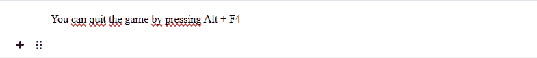

# EditorJS Inline Hotkey Plugin


Adds a Inline Hotkey Marker for [Editor.js](https://editorjs.io). This plugin uses the [<kbd></kbd>](https://developer.mozilla.org/en-US/docs/Web/HTML/Element/kbd) tag to stay in line with accessability rules and have semantic meaning to the marked text.



## Installation

Get the package

```shell
npm install editorjs-inline-hotkey
```

Include module at your application

```javascript
import EditorJSInlineHotkey from "editorjs-inline-hotkey"
```

## Usage
Add the plugin to your EditorJS instance:

```javascript
const editor = new EditorJS({
  holder: "your-holder",
  tools : {
    InlineHotkey: EditorJSInlineHotkey
  }
});
```

or in React with [react-editor-js](https://github.com/Jungwoo-An/react-editor-js).

```javascript
export const ReactEditor = () => {
  const ReactEditorJS = createReactEditorJS()

  return (
    <ReactEditorJS
      defaultValue={....}
      tools       ={{
        InlineHotkey: EditorJSInlineHotkey
      }}
    />
  )
}
```


## Style customization
You can customize the hotkey style by overwriting the `editorjs-inline-hotkey` class. By default it has these properties:

```css
.editorjs-inline-hotkey {
  padding      : 4px;
  color        : hsla(0, 0%, 20%, 1);
  font-weight  : 600;
  border-radius: 4px;
  font-size    : 13px;
  border       : 1px solid hsla(0, 0%, 80%, 1);
  box-shadow   : 0px 1px 0px hsla(0, 0%, 80%, 1);
}
```

## Development

```shell
npm run install
npm run watch
```

Open a pull request if you spot any bugs!

## License

This plugin is licensed under an MIT license.

## Acknowledgements

Made with 💛 by [Kaan Aksu](https://github.com/Stuhl)